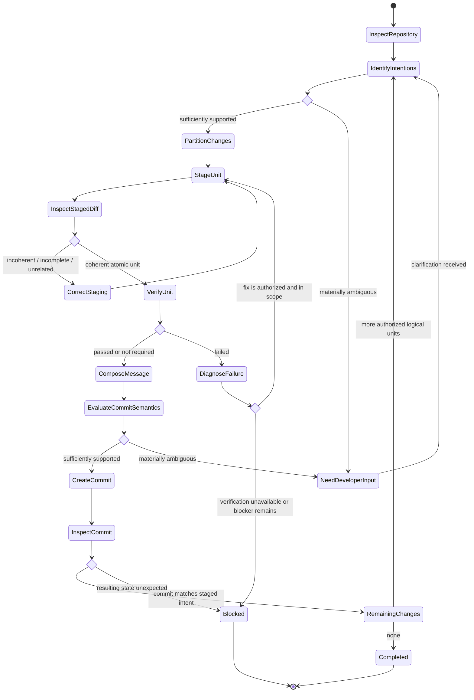

# Commit Changes

## Purpose

Create one or more safe, atomic commits from an explicitly authorized set of changes while preserving unrelated work and deriving commit semantics from evidence.

## Uses

* Rule: `contexts/git/rules/git.md`
* Rule: `contexts/git/rules/semantic-commit.md`

Optional requirement, specification, backlog, issue, or work-item context may be used as evidence of intent. It is never a required dependency and never overrides the staged diff or repository policy.

## Preconditions

* Creating commits is explicitly authorized.
* The repository is inspectable.
* No unresolved Git operation or conflict makes committing unsafe.
* The authorized change set can be distinguished from unrelated work.

## Workflow

1. Inspect branch, upstream, working tree, staged and unstaged changes, relevant diffs, nearby commit conventions, and available intent evidence.
2. Identify the logical intentions and dependencies represented by the authorized changes.
3. If semantic intent or the relationship between changes is materially ambiguous, ask the developer.
4. Partition authorized changes into the smallest coherent set of atomic commits; do not partition by file boundaries alone.
5. Preserve unrelated pre-existing staged and working-tree changes.
6. Stage exactly one logical unit, using path- or hunk-level staging when necessary.
7. Inspect the complete staged diff.
8. Correct staging if it contains unrelated intents or omits changes required for coherence.
9. Run the narrowest relevant verification when practical and required by repository policy.
10. Derive commit type, scope, summary, body, breaking-change metadata, and references from the staged diff, repository conventions, and supported intent evidence.
11. If commit semantics remain materially ambiguous, ask the developer.
12. Create the commit only when the staged diff and message describe the same logical unit.
13. Inspect the resulting commit and repository status.
14. Repeat for remaining authorized logical units.
15. Stop on material ambiguity, unsafe state, unavailable required verification, out-of-scope fixes, or unproductive repeated attempts.

## State Graph

## Boundaries

* Commit authorization does not authorize push, merge, rebase of shared history, tag, release, branch deletion, or remote-ref mutation.
* Do not bypass hooks or required checks.
* Do not amend or rewrite published history unless separately authorized.
