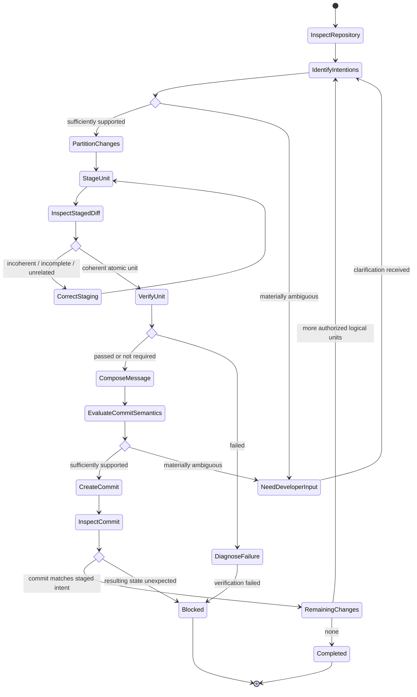

# Create Semantic Commits

## Purpose

Use when a task explicitly authorizes creating one or more commits. Convert an authorized set of changes into the smallest coherent sequence of atomic commits while applying the Git and semantic-commit rules.

## Uses

* Rule: `contexts/git/rules/git.md`
* Rule: `contexts/git/rules/semantic-commit.md`

## Preconditions

* Creating commits is explicitly authorized for a defined change scope.
* The repository is inspectable.
* No unresolved Git operation or conflict makes committing unsafe.
* The authorized change set can be distinguished from unrelated work.

## Operational Graph

## Workflow

1. Inspect the current branch, upstream, working tree, staged changes, unstaged changes, relevant diff, nearby commit conventions, and explicit developer context.
2. Identify the logical intentions and dependencies represented by the authorized changes.
3. If semantic intent or the relationship between changes is materially ambiguous, ask before partitioning or committing.
4. Partition the authorized changes into the smallest coherent set of atomic commits; do not partition by file boundaries alone.
5. Preserve unrelated pre-existing staged and working-tree changes.
6. Stage exactly one logical unit, using path- or hunk-level staging when necessary.
7. Inspect the complete staged diff.
8. Correct staging when it contains independent intents, unrelated changes, or omits changes required for a coherent and verifiable unit.
9. Run the narrowest relevant verification when practical and required by repository policy. If verification fails, diagnose enough to report the failure, but do not modify the implementation or authorized change set under commit-only authorization.
10. Derive type, scope, summary, body, breaking-change metadata, and references from the staged diff and verified context.
11. Ask before committing when material commit semantics remain ambiguous.
12. Create the commit only when the staged diff and message describe the same logical unit.
13. Inspect the resulting commit and repository status.
14. Repeat for remaining authorized logical units.
15. Stop when repository state is ambiguous, required verification is unavailable or fails, a material blocker remains, or continuing would require changing implementation semantics beyond staging/partitioning the already-authorized change set.

## Boundaries

* Commit authorization permits staging and partitioning the already-authorized changes, but it does not authorize editing production or test implementation to make verification pass.
* Commit authorization does not authorize push, merge, rebase of shared history, tag, release, branch deletion, worktree mutation, or remote-ref mutation.
* Do not bypass hooks, required checks, branch protections, signing requirements, or repository policy.
* Do not amend or rewrite published history unless separately authorized and sufficiently verified.

## Output

Report the commits created, the logical intent of each commit, verification performed, remaining changes, and any blocked or unresolved state. Never claim a commit exists without repository evidence.
