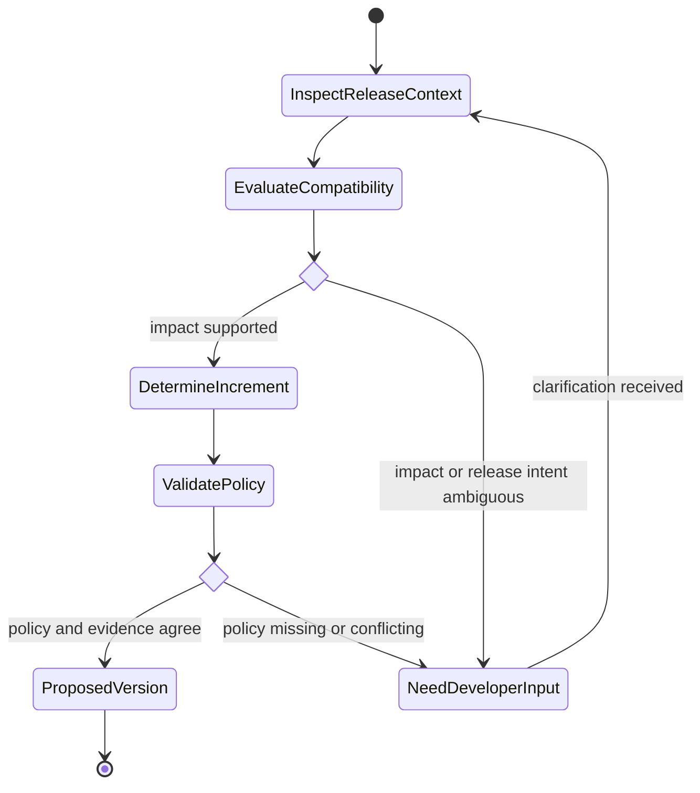

# Determine Semantic Version

## Purpose

Determine a semantic version increment from verified compatibility impact and repository release policy without inventing release intent.

## Uses

* Rule: `contexts/git/rules/git.md`
* Rule: `contexts/git/rules/semantic-version.md`

Optional requirements, backlog items, release notes, issues, or work-item context may provide evidence of intended public behavior. They do not replace inspection of actual compatibility impact.

## Workflow

1. Inspect the current version, versioning policy, public API or consumer contract, relevant changes, and release context.
2. Determine whether the change is breaking, backward-compatible additive behavior, backward-compatible correction, or not a release-relevant public change under the repository policy.
3. Distinguish implementation size from compatibility impact.
4. Check pre-1.0 or repository-specific versioning policy when applicable.
5. Reconcile code evidence, documented intent, and release metadata.
6. If compatibility impact or release intent is materially ambiguous, ask the developer.
7. Propose the increment and resulting version only when current version and policy are verified.
8. Report the evidence and any remaining uncertainty.

## State Graph

## Output

Return the current version, proposed increment, resulting version, compatibility rationale, supporting evidence, and unresolved issues.

## Boundary

Determining a version does not authorize editing version files, tagging, publishing, or releasing.
