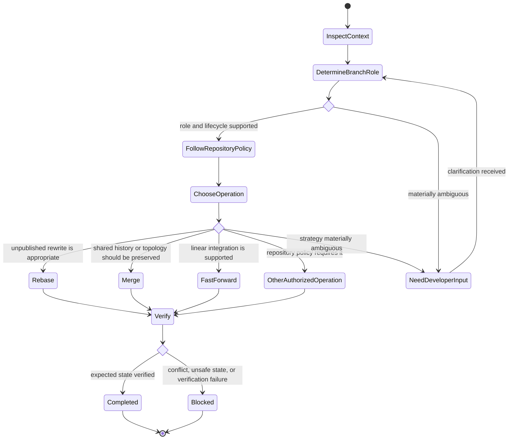

# Manage Branch Work

## Purpose

Perform authorized branch, synchronization, integration, or worktree operations using repository policy and verified branch intent.

## Uses

* Rule: `contexts/git/rules/git.md`
* Rule: `contexts/git/rules/gitflow.md` only when Gitflow applies.

## Workflow

1. Inspect repository state, branch role, upstreams, worktrees, active Git operations, and relevant remote references.
2. Refresh remote state when freshness matters.
3. Determine the branch lifecycle and correct base/target from repository policy and explicit intent.
4. If branch role or intended integration semantics are materially ambiguous, ask the developer.
5. Choose merge, rebase, fast-forward, or another repository-supported strategy according to publication state, topology, and policy.
6. Protect unrelated work and shared history.
7. Execute only the specifically authorized mutation.
8. Inspect resulting history, working-tree state, and relevant verification.
9. Report verified state without implying push, merge, publication, or release that did not occur.

## State Graph

## Parallel Work

Use dedicated worktrees only when tasks are safely independent. Serialize tightly coupled or substantially overlapping work. A worktree isolates the working tree, not repository-level refs and objects.

## Boundary

Branch-work authorization does not imply permission to push, delete remote refs, rewrite published history, tag, or release unless separately authorized.
