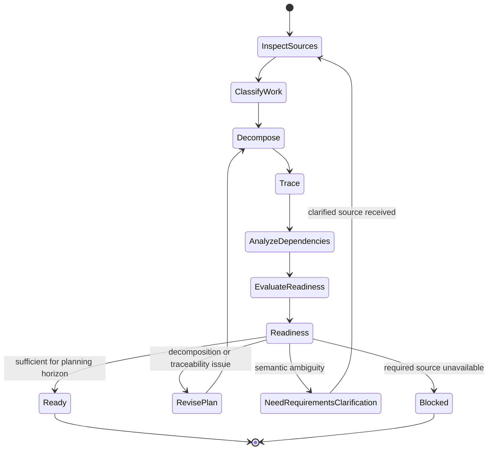

# Backlog Planning

## Purpose

Use to transform sufficiently defined requirements and other supported work sources into a structured, traceable backlog without silently changing source semantics.

## Uses

* Rule: `contexts/requirements/rules/requirements.md`
* Rule: `contexts/requirements/rules/backlog.md`
* Contract: `contracts/requirements.md`
* Contract: `contracts/work-item.md`

## Modes

### Build

Create planning items from sufficiently specified source material.

### Refine

Improve an existing backlog while preserving requirement semantics and traceability.

Both modes use the same decomposition and validation workflow. Refinement is not a separate source of requirements.

## State Model

## Workflow

1. Inspect validated requirements, defects, risks, decisions, other explicit work sources, the existing backlog when refining, and target tracker hierarchy or item taxonomy when one exists.
2. Separate requirement semantics from planning choices.
3. Preserve established tracker hierarchy, item kinds, and required metadata unless they conflict with semantic integrity.
4. Group and decompose work by coherent deliverable intent, behavior, risk, dependency, or independently valuable outcome.
5. Preserve requirement identifiers and acceptance semantics.
6. Record dependencies, preferred sequencing, risks, assumptions, blockers, and unresolved questions.
7. Allow technical or enabling tasks only when their source outcome, requirement, constraint, dependency, or risk is explicit.
8. Avoid implementation decomposition that would prematurely select an unsupported solution.
9. Evaluate whether each item has sufficient semantic context for the intended planning horizon; do not require design details that can legitimately be decided later.
10. Perform closure analysis: identify orphan source obligations, orphan work items, duplicated scope, hidden scope expansion, inconsistent acceptance semantics, and unresolved dependency cycles.
11. Account explicitly for material source obligations that are deferred, rejected, external, out of scope, or otherwise intentionally unplanned.
12. Return material semantic ambiguity to requirements definition or elicitation rather than inventing detail.
13. In `refine` mode, preserve source semantics while improving clarity, decomposition, traceability, and dependency information.

## Output

Produce `contracts/work-item.md`-compatible items with coherent intent, source traceability, acceptance evidence, dependencies, risks, assumptions, and readiness state. Include closure findings for material source obligations or work items that are not accounted for. Do not invent priority, estimates, owners, iterations, or deadlines.

## Stop Conditions

Stop the affected planning decision and surface the issue when:

* decomposition would require inventing or materially changing source semantics;
* a source conflict or unresolved requirement ambiguity changes item scope, acceptance, or dependency structure;
* an apparently required task would prematurely encode an unsupported design decision;
* required planning evidence is unavailable;
* repeated refinement is not reducing a material traceability, dependency, or readiness problem.
