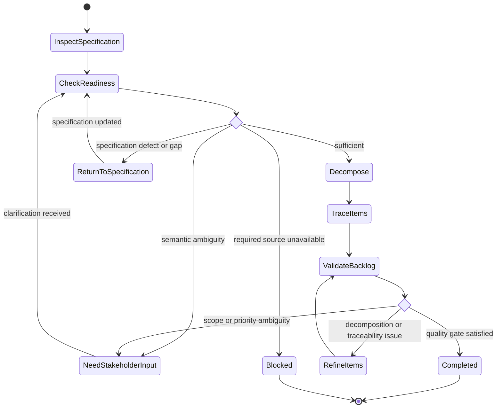

# Build or Refine Backlog

## Purpose

Decompose sufficiently specified requirements into structured delivery work while preserving semantics and traceability.

## Uses

* Rule: `contexts/requirements/rules/requirements.md`
* Rule: `contexts/requirements/rules/backlog.md`
* Contract: `contracts/requirements-workflow.md`

## Modes

* `build` — create a backlog from a sufficiently specified requirement set.
* `refine` — improve an existing backlog without silently changing requirement semantics.

Both modes use the same workflow because refinement is a change to the same delivery decomposition, not a separate source of requirements.

## Workflow

1. Inspect the requirement set, readiness state, existing backlog, tracker conventions, and supported hierarchy.
2. Identify material unresolved questions that would change decomposition, acceptance, or dependencies.
3. If such ambiguity exists, request clarification or return the affected requirement for specification.
4. Determine coherent delivery outcomes and necessary enabling work.
5. Decompose by outcome, dependency, risk, and verification boundary rather than file boundaries.
6. Preserve or assign work-item identifiers according to the target system.
7. Link every item to the requirements, constraints, or decisions that justify it.
8. Carry acceptance conditions forward; narrow them only when the item boundary requires it.
9. Record dependencies and sequencing separately from priority.
10. Preserve provided priorities; do not invent business priority, estimates, owners, dates, or releases.
11. Check for orphan requirements, orphan work items, duplicated scope, hidden scope expansion, and inconsistent acceptance.
12. Produce backlog records using `contracts/requirements-workflow.md`.

## State Graph

## Output

Return structured backlog records, traceability, dependencies, readiness, and unresolved questions.
