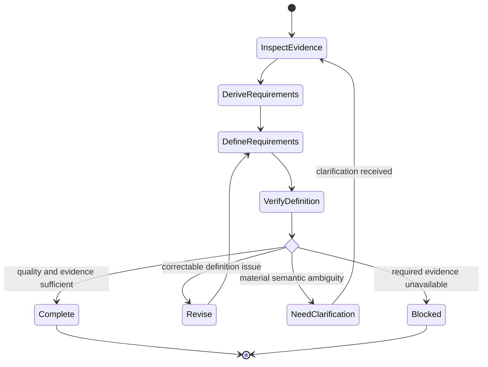

# Requirements Definition

## Purpose

Use to transform sufficiently understood needs and evidence into precise, verifiable, traceable requirements without inventing missing stakeholder intent.

## Uses

* Rule: `contexts/requirements/rules/requirements.md`
* Contract: `contracts/requirement-specification.md`

## State Model

## Workflow

1. Inspect elicitation evidence, existing requirements, governing constraints, domain terminology, and unresolved questions.
2. Determine which needs are sufficiently supported to become requirements and which must remain assumptions or open questions.
3. Define functional behavior, quality attributes, business rules, constraints, interfaces, data conditions, states, transitions, failure behavior, and invariants when material.
4. Define acceptance criteria as observable evidence of satisfaction without prescribing an unnecessary test or implementation technique.
5. Preserve source provenance and stable traceability identifiers when available.
6. Check necessity, clarity, singularity, consistency, feasibility status, verifiability, completeness for the intended downstream use, and traceability.
7. Surface contradictions and material ambiguity. Return stakeholder-intent questions to elicitation rather than resolving them by invention.
8. Produce a specification only for semantics supported by evidence; keep unresolved material explicitly open.

## Output

Produce a `contracts/requirement-specification.md`-compatible specification with requirements, acceptance criteria, business rules, constraints, assumptions, dependencies, traceability, and unresolved questions.
