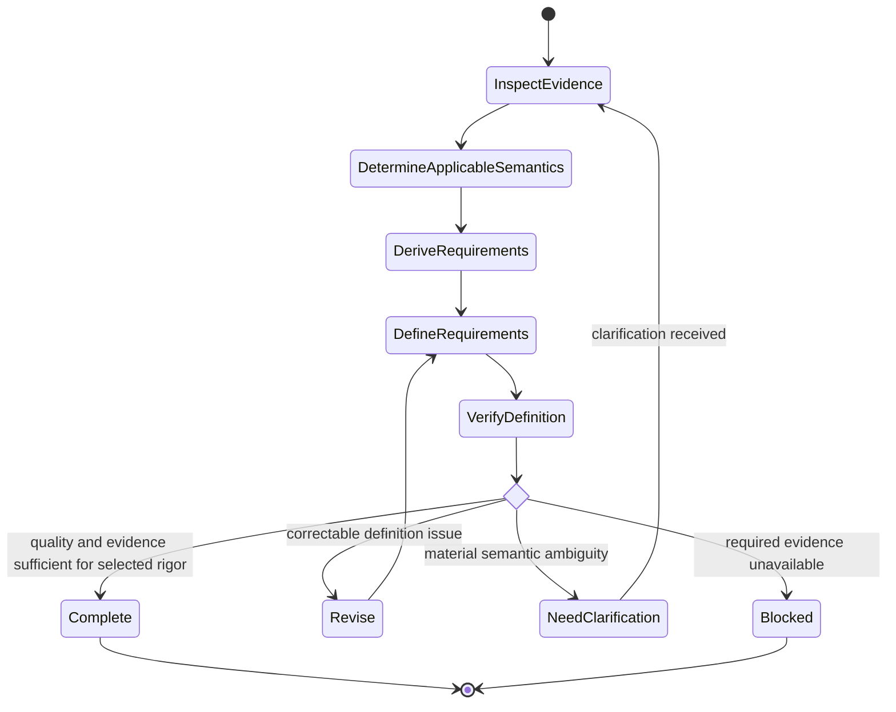

# Requirements Definition

## Purpose

Use to transform sufficiently understood needs and evidence into precise, verifiable, traceable requirements with rigor proportional to the context and without inventing missing stakeholder intent.

## Uses

* Rule: `contexts/requirements/rules/tailoring.md`
* Rule: `contexts/requirements/rules/requirements.md`
* Contract: `contracts/requirements.md`
* Optional handoff: `contracts/test-basis.md`

## State Model

## Workflow

1. Inspect the elicitation handoff, rigor profile, applicable concerns, existing requirements, governing constraints, domain terminology, decisions, and unresolved questions.
2. If rigor or applicable concerns were not established and they materially affect specification depth, assess them using `tailoring.md` before claiming completeness.
3. Determine which needs are sufficiently supported to become requirements and which must remain assumptions, options, candidate solutions, or open questions.
4. Preserve the relationship from Need and Business Goal to requirements; require rationale where the requirement's necessity is not evident from its source.
5. Define only the requirement semantics that are material to the context, including as relevant:
   * functional behavior, actor goals, use cases, scenarios, states, transitions, guarantees, alternatives, exceptions, and invariants;
   * business rules, rule governance, policies, and external constraints;
   * interfaces and compatibility;
   * data meaning, ownership, precision, temporal semantics, lifecycle, lineage, privacy, consistency, and distributed-data guarantees;
   * quality goals, fit criteria, failure assumptions, justified thresholds, and trade-offs;
   * security actors, information, operations, purposes, delegations, organizational obligations, misuse, and threat-related constraints;
   * transition requirements distinct from permanent solution requirements.
6. Use requirement patterns only as prompts to investigate potentially relevant concerns; never copy a pattern into the specification without supporting evidence.
7. Define acceptance criteria, fit criteria, or other observable evidence of satisfaction without prescribing an unnecessary test level or implementation technique.
8. When behavioral scenarios are material, preserve or establish stable scenario identities and their traceability to requirements, rules, use cases, and slices. Use `contexts/requirements/skills/example-discovery/skill.md` when scenarios/examples need dedicated exploration.
9. Use concrete examples or boundary cases when they improve shared understanding; keep business examples free of implementation noise unless that detail is itself required.
10. Preserve source provenance, rationale, authority, requirement identifiers, rule identifiers, and scenario identifiers when available.
11. Check necessity, clarity, singularity, consistency, feasibility status, verifiability, completeness for the intended downstream use, and proportionality to the selected rigor.
12. Check explicitly for duplicate requirements, orphan requirements, orphan scenarios, hidden compound obligations, unsupported thresholds or precision, contradictory rules, and solution leakage.
13. Surface contradictions and material ambiguity. Return stakeholder-intent questions to elicitation rather than resolving them by invention.
14. Produce a specification only for semantics supported by evidence; keep unresolved material explicitly open.

## Output

Produce a `contracts/requirements.md`-compatible specification containing the applicable strategic traceability, requirements, rules, constraints, acceptance/fit evidence, scenarios, assumptions, options, dependencies, conflicts, and unresolved questions. When a portable Scenario Set is useful for downstream behavioral verification, expose it through `contracts/test-basis.md` while preserving the same scenario identities.

Do not create fields merely to satisfy a schema when the corresponding knowledge is not relevant.

## Stop Conditions

Stop the affected definition decision and surface the issue when:

* evidence supports multiple materially different requirement interpretations;
* a required threshold, actor, policy, boundary, security obligation, data semantic, or acceptance meaning is unsupported;
* source conflicts require stakeholder or developer authority to resolve;
* continuing would require converting a design preference into stakeholder intent;
* required evidence is unavailable and the affected requirement cannot be meaningfully defined without it.
