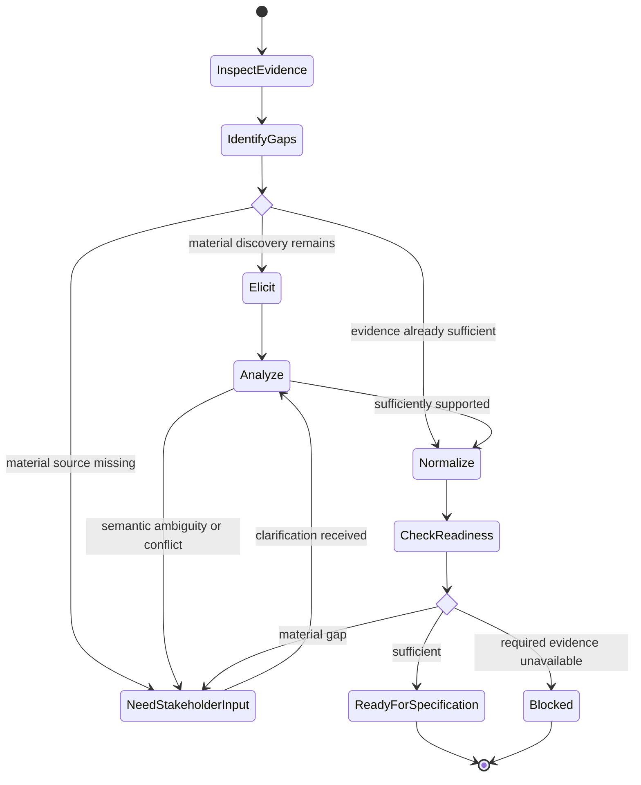

# Elicit Requirements

## Purpose

Discover and structure stakeholder needs, outcomes, constraints, rules, and unresolved questions without prematurely turning them into implementation decisions.

## Uses

* Rule: `contexts/requirements/rules/requirements.md`
* Contract: `contracts/requirements-workflow.md`

## Inputs

Use the smallest sufficient set of available evidence, such as:

* stakeholder statements or conversations;
* problem statements and business goals;
* existing product or process documentation;
* observed workflows and current behavior;
* regulations, contracts, policies, or external constraints;
* existing issues, incidents, support evidence, analytics, or research;
* explicit developer context.

## Workflow

1. Establish the problem or opportunity, affected actors, desired outcomes, and known scope.
2. Inventory available evidence and provenance before asking new questions.
3. Identify missing stakeholder perspectives or source gaps that can materially change the outcome.
4. Elicit needs, rules, functional behavior, quality expectations, constraints, dependencies, risks, and exclusions.
5. Separate direct statements from interpretation, assumptions, and derived implications.
6. Detect conflicts, overloaded terms, hidden decisions, and solution-first statements.
7. Ask focused clarification questions only for gaps that materially affect semantics, scope, acceptance, or downstream work.
8. Normalize the result into the elicitation handoff defined by `contracts/requirements-workflow.md`.
9. Mark readiness for specification only when remaining gaps do not prevent meaningful specification.

## State Graph

## Output

Produce an elicitation handoff with provenance, candidate requirements, constraints, assumptions, conflicts, and open questions. Do not present candidate material as approved specification.

## Stop Conditions

Stop and surface the issue when:

* a required stakeholder or authoritative source is unavailable;
* conflicting evidence cannot be resolved within the authorized interaction;
* continuing would require inventing material intent;
* the requested scope exceeds the available authority or evidence.
