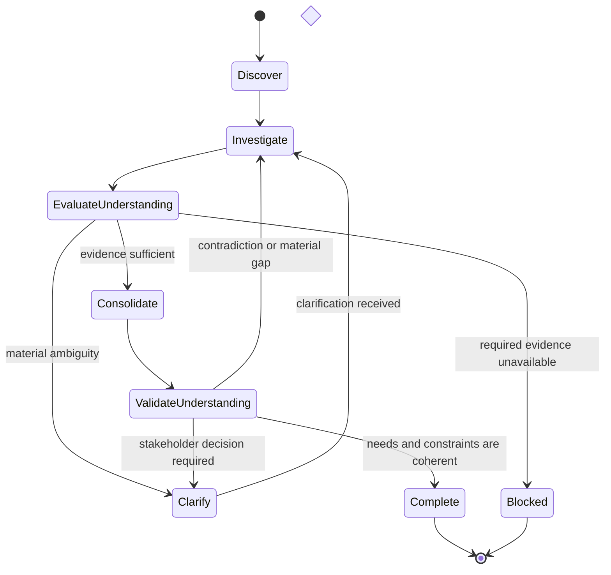

# Requirements Elicitation

## Purpose

Use to discover and structure stakeholder needs, goals, context, constraints, business rules, risks, conflicts, and unknowns before formal specification.

## Uses

* Rule: `contexts/requirements/rules/requirements.md`

## State Model

## Working State

Maintain:

* problem and operating context;
* stakeholders and affected actors;
* goals and desired outcomes;
* observed needs and pain points;
* business rules and external constraints;
* assumptions and evidence provenance;
* conflicts, risks, dependencies, and unknowns;
* open questions and decisions required.

## Workflow

1. Establish the problem context, objective, scope boundary, available sources, and known stakeholders.
2. Inspect supplied evidence before asking questions that the evidence already answers.
3. Discover goals, needs, actors, workflows, constraints, business rules, failure concerns, dependencies, and success signals.
4. Separate directly stated information from derived implications and assumptions.
5. Investigate contradictions and missing context that can materially alter semantics or scope.
6. Ask focused clarification questions only for material ambiguity; avoid interrogating low-impact uncertainty.
7. Consolidate equivalent statements without erasing meaningful differences in source, actor, condition, or priority.
8. Validate the resulting understanding against the available evidence and stakeholder context.
9. Stop with explicit unresolved questions when required evidence or a stakeholder decision is unavailable.

## Output

Produce an elicitation record containing supported needs, goals, stakeholders, constraints, business rules, risks, assumptions, provenance, conflicts, and open questions. Do not silently convert unresolved intent into formal requirements or backlog items.
