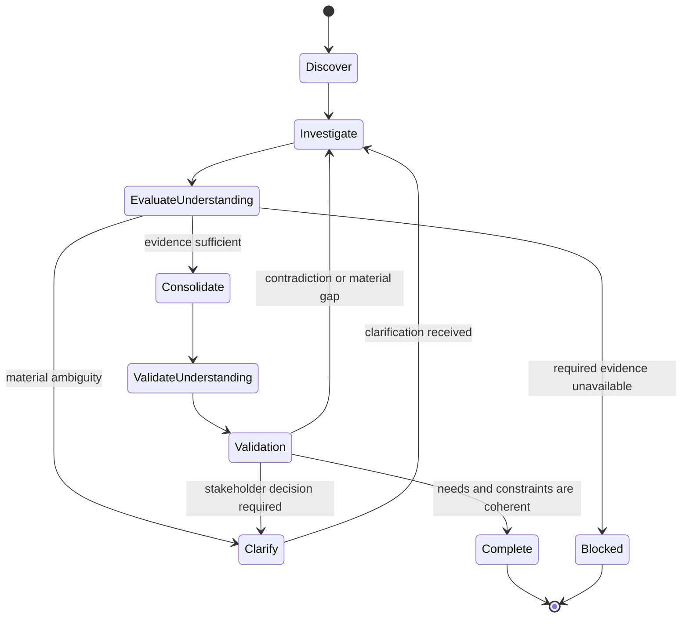

# Requirements Elicitation

## Purpose

Use to discover and structure stakeholder needs, goals, context, constraints, business rules, risks, conflicts, and unknowns before formal specification.

## Uses

* Rule: `contexts/requirements/rules/requirements.md`
* Contract: `contracts/requirements.md`

## State Model

## Working State

Maintain:

* problem and operating context;
* stakeholders and affected actors;
* goals and desired outcomes;
* observed needs and pain points;
* business rules and external constraints;
* assumptions and evidence provenance;
* conflicts, risks, dependencies, and unknowns;
* open questions and decisions required.

## Workflow

1. Establish the problem context, objective, scope boundary, available sources, and known stakeholders.
2. Inspect supplied evidence before asking questions that the evidence already answers.
3. Identify materially affected stakeholder perspectives or authoritative sources that are not represented and could change the resulting understanding.
4. Discover goals, needs, actors, workflows, constraints, business rules, failure concerns, dependencies, exclusions, and success signals.
5. Separate directly stated information from derived implications, assumptions, proposed solutions, and already-made decisions.
6. Detect contradictions, overloaded terms, hidden decisions, and solution-first statements; recover the underlying need unless the proposed solution is itself an explicit constraint or decision.
7. Investigate missing context that can materially alter semantics, scope, acceptance, or downstream work.
8. Ask focused clarification questions only for material ambiguity; avoid interrogating low-impact uncertainty.
9. Consolidate equivalent statements without erasing meaningful differences in source, actor, condition, priority, or authority.
10. Validate the resulting understanding against the available evidence and represented stakeholder context.
11. Stop with explicit unresolved questions when required evidence or a stakeholder decision is unavailable.

## Output

Produce an elicitation handoff conforming to the elicitation semantics in `contracts/requirements.md`, containing supported needs, goals, stakeholders, constraints, business rules, risks, assumptions, provenance, conflicts, and open questions. Do not silently convert unresolved intent into formal requirements or backlog items.

## Stop Conditions

Stop the affected line of work and surface the issue when:

* a materially required stakeholder perspective or authoritative source is unavailable;
* conflicting evidence cannot be resolved within the authorized interaction;
* continuing would require inventing material stakeholder intent;
* the requested scope exceeds the available authority or evidence;
* repeated clarification attempts are not producing new evidence or narrowing the ambiguity.
