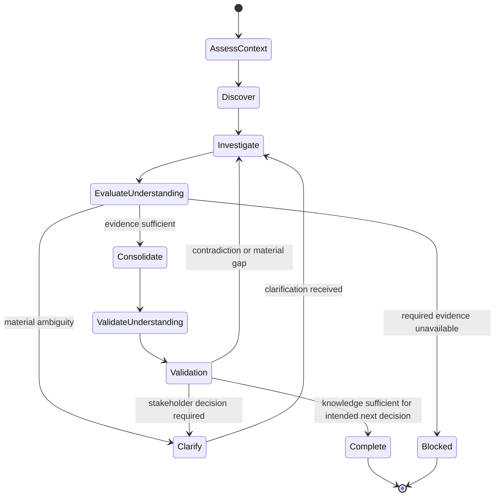

# Requirements Elicitation

## Purpose

Use to discover and structure the knowledge needed to understand a change before formal specification, applying only the rigor justified by its risk and uncertainty.

## Uses

* Rule: `contexts/requirements/rules/tailoring.md`
* Rule: `contexts/requirements/rules/requirements.md`
* Contract: `contracts/requirements.md`

## State Model

## Working State

Maintain only the concerns that are material to the context, including when relevant:

* selected rigor: `lightweight`, `standard`, or `high-assurance`, with rationale;
* applicable and explicitly non-applicable knowledge concerns;
* need, business goals, desired outcomes, and success evidence;
* current state, future state, and material change gaps;
* work scope and product/software boundary;
* stakeholders, affected actors, and relevant authority;
* business events and business responses;
* domain terms, facts, business rules, and external constraints;
* candidate solutions or learning options when solution uncertainty matters;
* transition needs for migration, rollout, compatibility, cutover, training, or decommissioning;
* risks, dependencies, assumptions, unknowns, options, conflicts, and provenance;
* open questions and decisions required.

## Workflow

1. **Assess context and required rigor.**
   * Consider business/customer/financial impact, security, privacy, compliance, domain and technical complexity, integrations, teams, migration/legacy, reversibility, uncertainty, expected change frequency, and solution lifetime when relevant.
   * Select `lightweight`, `standard`, or `high-assurance` only when a rigor label is useful, and record why.
   * Determine which knowledge concerns are applicable; do not turn the framework into a mandatory artifact checklist.

2. **Establish strategic framing.**
   * Identify the underlying Need or opportunity without prematurely encoding a solution.
   * Identify supported Business Goals and observable success evidence.
   * Distinguish business success metrics from fit criteria, acceptance criteria, and test assertions.

3. **Understand change and scope.**
   * Capture relevant Current State, desired Future State, and material gaps.
   * Distinguish Work Scope from Product Boundary when the change may involve people, process, policy, purchased products, manual operations, or partial automation.
   * Ask, when material, why the problem needs software rather than assuming it does.
   * Identify transition concerns separately from permanent product behavior.

4. **Investigate business behavior and knowledge.**
   * Inspect supplied evidence before asking questions that it already answers.
   * Identify materially affected stakeholder perspectives or authoritative sources that are not represented.
   * Discover goals, needs, actors, workflows, business events, rules, constraints, failures, dependencies, exclusions, and success signals.
   * Preserve important domain terms and facts; distinguish true business rules from historical implementation limitations.

5. **Separate evidence from interpretation.**
   * Distinguish directly stated information, derived implications, assumptions, options, proposed solutions, and explicit decisions.
   * Detect contradictions, overloaded terms, hidden decisions, and solution-first statements.
   * When a proposed solution is not a supported constraint or decision, recover the underlying need and keep the proposal as an option.

6. **Explore uncertainty proportionally.**
   * For material unknowns, record the risk if unresolved and how the knowledge could be obtained.
   * When solution uncertainty matters, preserve candidate alternatives and consider whether a prototype, experiment, probe, spike, or thin slice is the appropriate next learning step.
   * Ask focused clarification questions only when ambiguity can materially change semantics, scope, acceptance, risk, or downstream work.

7. **Consolidate and validate understanding.**
   * Consolidate equivalent statements without erasing meaningful differences in source, actor, condition, authority, or rationale.
   * Validate the resulting understanding against available evidence and represented stakeholder context.
   * Check for both under-engineering and unnecessary analysis/documentation.
   * Stop with explicit unresolved questions when required evidence or authority is unavailable.

## Output

Produce an elicitation handoff conforming to `contracts/requirements.md`. Include the selected rigor and applicable concerns when material, plus supported strategic framing, stakeholder/domain knowledge, constraints, risks, assumptions, options, conflicts, provenance, and open questions.

Do not silently convert unresolved intent into formal requirements, architecture, backlog items, or software scope.

## Stop Conditions

Stop only the affected line of work and surface the issue when:

* a materially required stakeholder perspective or authoritative source is unavailable;
* conflicting evidence cannot be resolved within the authorized interaction;
* continuing would require inventing material stakeholder intent;
* product/software scope would have to be assumed without evidence;
* the requested scope exceeds the available authority or evidence;
* repeated clarification or discovery attempts are not producing useful learning.
