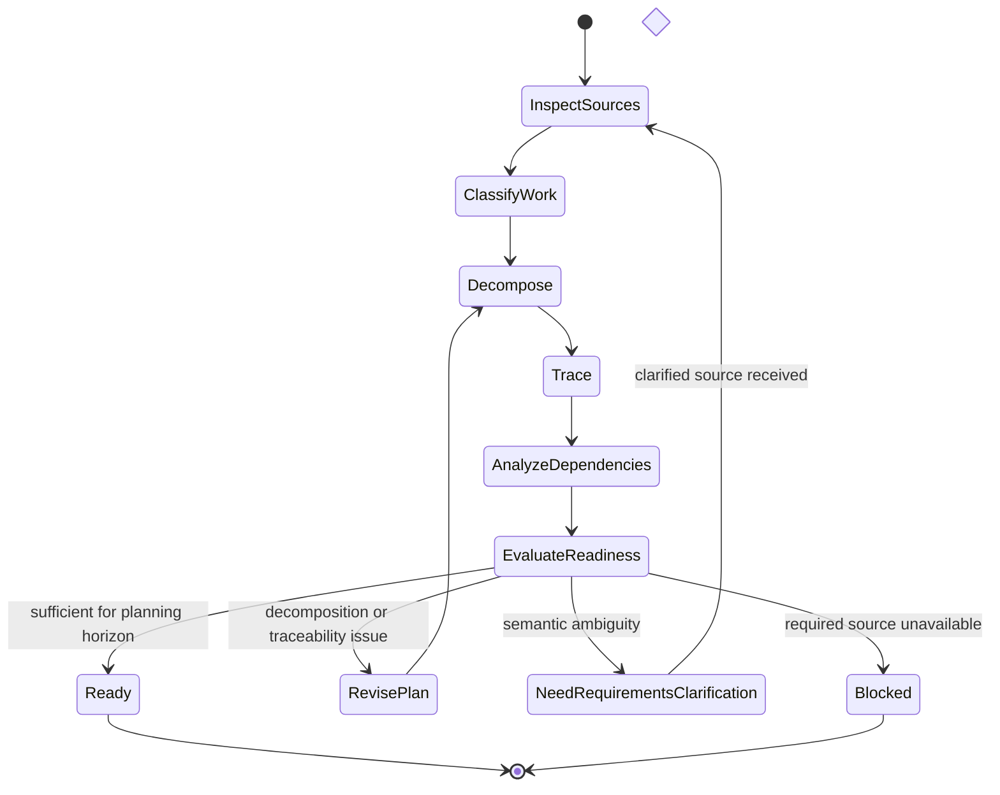

# Backlog Planning

## Purpose

Use to transform sufficiently defined requirements and other supported work sources into a structured, traceable backlog without silently changing source semantics.

## Uses

* Rule: `contexts/requirements/rules/requirements.md`
* Rule: `contexts/requirements/rules/planning.md`
* Contract: `contracts/requirement-specification.md`
* Contract: `contracts/backlog-item.md`

## State Model

## Workflow

1. Inspect validated requirements, defects, risks, decisions, and other explicit work sources.
2. Separate requirement semantics from planning choices.
3. Group and decompose work by coherent deliverable intent, behavior, risk, dependency, or independently valuable outcome.
4. Preserve requirement identifiers and acceptance semantics.
5. Record dependencies, preferred sequencing, risks, assumptions, blockers, and unresolved questions.
6. Avoid implementation decomposition that would prematurely select an unsupported solution.
7. Evaluate whether each item has sufficient context for the intended planning horizon.
8. Return material semantic ambiguity to requirements definition or elicitation rather than inventing detail.
9. When refining an existing backlog, preserve source semantics while improving clarity, decomposition, traceability, and dependency information.

## Output

Produce `contracts/backlog-item.md`-compatible items with coherent intent, source traceability, acceptance evidence, dependencies, risks, assumptions, and readiness state. Do not invent priority, estimates, owners, iterations, or deadlines.
