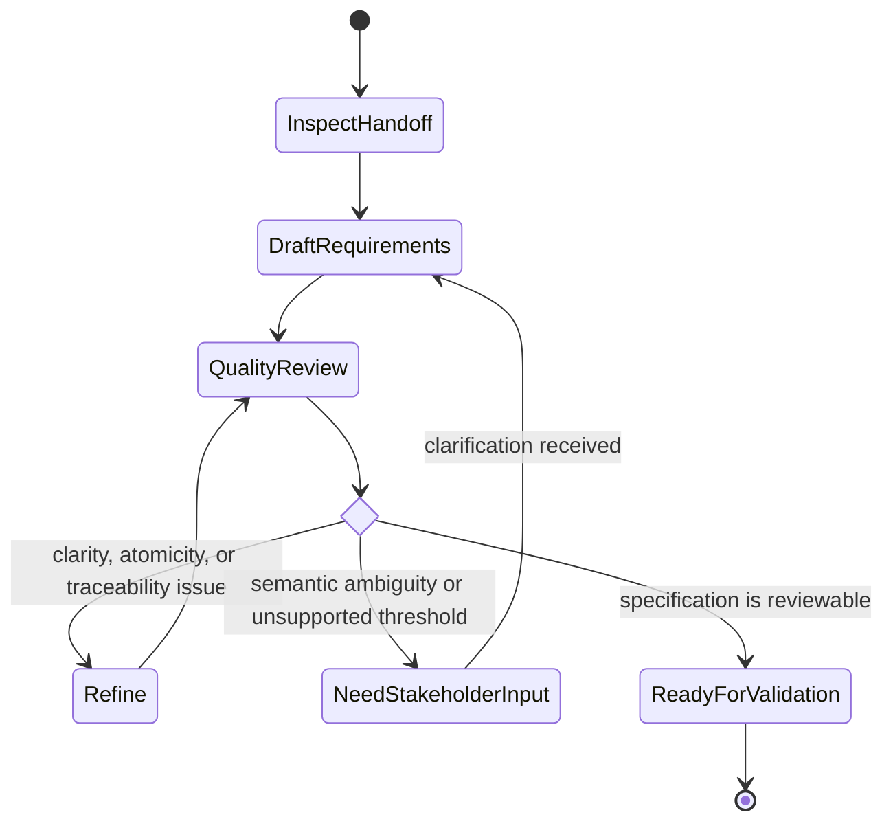

# Specify Requirements

## Purpose

Transform elicited, evidenced needs into precise, traceable, verifiable requirements without changing stakeholder intent.

## Uses

* Rule: `contexts/requirements/rules/requirements.md`
* Contract: `contracts/requirements-workflow.md`

## Inputs

Prefer the elicitation handoff contract. Existing specifications, requirements, decisions, and authoritative source material may also be used directly when provenance is preserved.

## Workflow

1. Inspect source evidence, decisions, assumptions, conflicts, and open questions.
2. Establish or preserve stable requirement identifiers.
3. Separate requirements from rationale, design choices, tasks, and explanatory context.
4. Write normative statements with one materially relevant interpretation.
5. Define observable acceptance conditions where satisfaction otherwise cannot be determined.
6. Capture relevant constraints, dependencies, relationships, and quality attributes.
7. Check for contradictions, duplicates, hidden compound requirements, unsupported thresholds, and solution leakage.
8. When a material ambiguity remains, request stakeholder or developer clarification rather than selecting an interpretation.
9. Produce specification records using `contracts/requirements-workflow.md`.
10. Mark each record and the overall set with its actual readiness state.

## State Graph

## Output

Produce requirement records with stable IDs, normative statements, provenance, acceptance conditions, relationships, status, and unresolved questions.

## Boundaries

* Do not prioritize requirements unless priority evidence exists.
* Do not choose architecture or implementation merely to make a requirement concrete.
* Do not erase source disagreement.
* Do not claim approval or feasibility without evidence.
