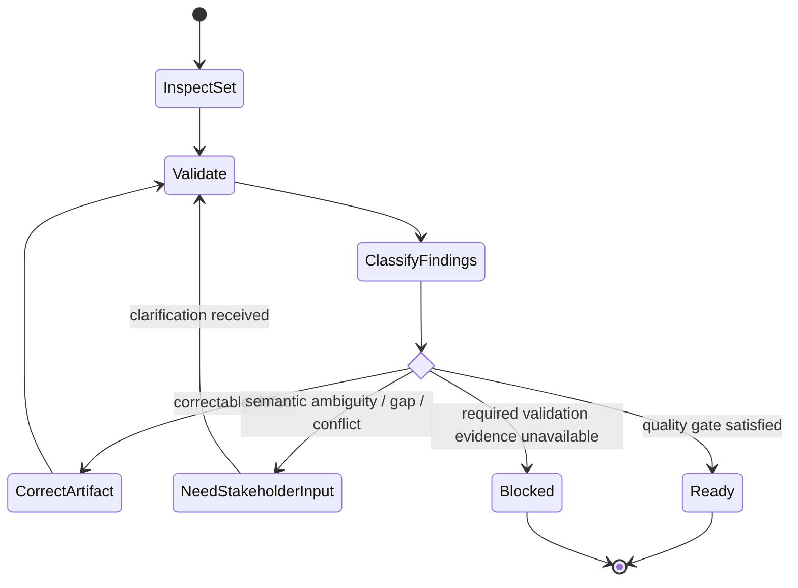

# Validate Requirements

## Purpose

Evaluate whether a requirement set is sufficiently correct, clear, consistent, traceable, and verifiable for its intended downstream use.

## Uses

* Rule: `contexts/requirements/rules/requirements.md`
* Contract: `contracts/requirements-workflow.md`

## Validation Dimensions

Check:

* provenance and source coverage;
* semantic clarity;
* completeness relative to evidenced scope;
* internal consistency and conflict state;
* atomicity and unnecessary coupling;
* implementation neutrality unless a solution constraint is explicit;
* observable acceptance conditions;
* dependencies and relationships;
* traceability;
* feasibility evidence when feasibility is claimed;
* unresolved assumptions and open questions.

## Workflow

1. Determine the intended readiness target, such as stakeholder review or backlog planning.
2. Validate each requirement and the set as a whole.
3. Classify findings as:
   * defect — the artifact contradicts evidence or its own rules;
   * ambiguity — multiple materially different interpretations remain;
   * gap — required information is absent;
   * conflict — supported sources disagree;
   * risk — the requirement is usable but carries material uncertainty or dependency.
4. Correct only defects that can be corrected without inventing stakeholder intent.
5. Route semantic ambiguity, gaps, and unresolved conflicts to the appropriate stakeholder or developer.
6. Revalidate affected relationships and traceability after corrections.
7. Report actual readiness; do not convert unresolved findings into a pass.

## State Graph

## Output

Return findings, affected requirement IDs, evidence, required decisions, and readiness for the requested downstream stage.
