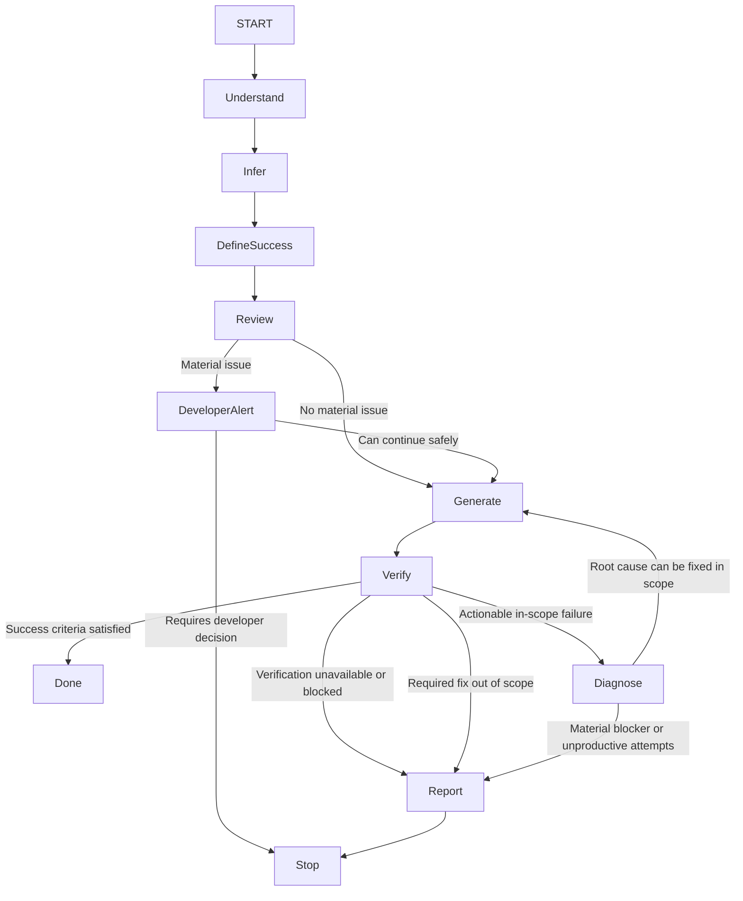

# Generate Automated Tests

## Purpose

Use when creating, extending, or modifying automated tests. Generate complete, maintainable tests while applying `contexts/testing/rules/testing.md`.

## Operational Graph

## Working State

The workflow progressively establishes and refines:

* Behavioral context, contract, scope, and boundaries.
* Material assumptions and unresolved uncertainty.
* Project testing tooling and conventions.
* Risks, scenarios, and relevant test techniques.
* Success criteria and test strategy.
* Generated or modified tests.
* Verification evidence and quality-gate outcomes.
* Blockers, out-of-scope requirements, or unresolved failures.

## Execution Contracts

### Understand

**Produces:** behavioral contract, scope, boundaries, and material assumptions.

### Infer

**Requires:** understood context.

**Produces:** project testing tooling, conventions, prioritized risks, scenarios, and relevant techniques.

### Define Success

**Requires:** behavior, risks, and project context.

**Produces:** observable success criteria, test level, required scenarios, doubles, and isolation boundaries.

### Review

**Requires:** understood behavior and proposed test strategy.

**Produces:** continue, **Developer Alert**, or a blocker requiring developer decision.

### Generate

**Requires:** success criteria and test strategy.

**Produces:** complete, runnable tests consistent with the project and `contexts/testing/rules/testing.md`.

### Verify

**Requires:** generated or modified tests.

**Produces:** verification evidence and one of:

* success;
* actionable in-scope failure;
* unavailable or blocked verification;
* required fix outside scope.

### Diagnose

**Requires:** failed verification evidence.

**Produces:** an in-scope root-cause correction or a material blocker.

## Workflow

1. **Understand the context**

   * Read the behavior under test, its public contract, immediate collaborators, and nearby test conventions before making changes.
   * Determine expected behavior, scope, and boundaries.
   * State material assumptions explicitly. If ambiguity can materially change the expected behavior, ask rather than guess.

2. **Infer project context and map behavior and risk**

   * Identify and follow the project's testing framework, assertion library, mocking tools, test commands, and conventions from repository evidence such as existing tests, configuration, manifests, and scripts.
   * Identify and prioritize scenarios by behavior criticality and risk, including critical paths, edge cases, invariants, boundaries, decisions, states, side effects, failure modes, and realistic misuse.
   * Select relevant techniques such as Equivalence Partitioning, Boundary Value Analysis, Decision Tables, State Transition, Use Case-Based, Path Analysis, Pairwise, Negative Testing, Property-Based Testing, or Fuzz Testing.

3. **Define success and test strategy**

   * Define the observable success criteria the tests must prove.
   * Choose the lowest test level that provides sufficient confidence.
   * Define the required scenarios and whether specialized testing is relevant.
   * Select appropriate doubles and isolation boundaries.

4. **Review design and testability**

   * Evaluate the Design and Testability Smells in `contexts/testing/rules/testing.md`.
   * If a probable issue materially harms testability, maintainability, predictability, or architectural integrity, output a **Developer Alert** before generating the full test suite and explain the issue concisely.
   * Continue only when the issue can be handled safely within scope; otherwise report the blocker or required developer decision.
   * For legacy or constrained code, prefer characterization tests when needed to make change safe.

5. **Generate the tests**

   * Follow project conventions and `contexts/testing/rules/testing.md`.
   * Keep setup minimal and explicit.
   * Use realistic, non-sensitive data.
   * Generate complete, runnable tests.

6. **Verify the result**

   * Confirm the tests protect intended contracts, rules, invariants, or outcomes.
   * Confirm relevant success, failure, edge, boundary, state, side-effect, retry, replay, idempotency, and substitutability concerns were considered.
   * Confirm determinism, isolation, reproducibility, and CI suitability.
   * Confirm the tests avoid shallow assertions, over-mocking, brittle implementation checks, and unnecessary complexity.
   * Run the narrowest relevant verification first, then the applicable project quality gates.
   * Read verification evidence before deciding whether the work is complete or requires diagnosis.
   * When the project uses quality baselines or ratcheted metrics, preserve or improve them; do not introduce measurable regressions.
   * Record the verification commands executed and their outcomes.
   * Ensure a developer can understand the test intent and likely failure reason from its name, setup, and assertions.

7. **Diagnose and iterate**

   * When verification exposes an actionable in-scope failure, diagnose the root cause before changing code.
   * Fix the root cause within scope and rerun the affected checks.
   * Continue only while meaningful progress is being made.
   * Stop and report when required verification is unavailable, a material blocker remains, the required fix falls outside scope, or repeated attempts are not producing meaningful progress.

## Output

* Start with a brief summary of the test strategy and material risks.
* If a **Developer Alert** is required, present it before the tests.
* Provide complete, copy-pasteable test code in standard Markdown code blocks.
* Report verification commands and outcomes, including failing, skipped, blocked, or unexecuted checks, measurable regressions, and material uncertainty; never imply successful validation when verification is incomplete.
* Keep explanations concise; let test names and assertions describe the behavior.
